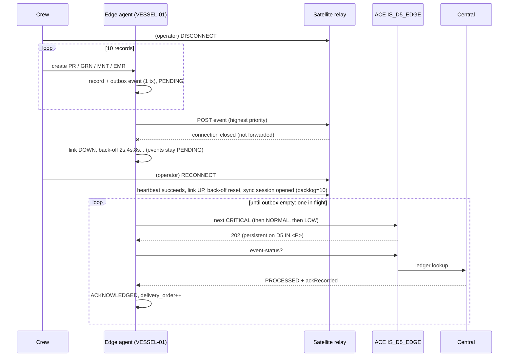
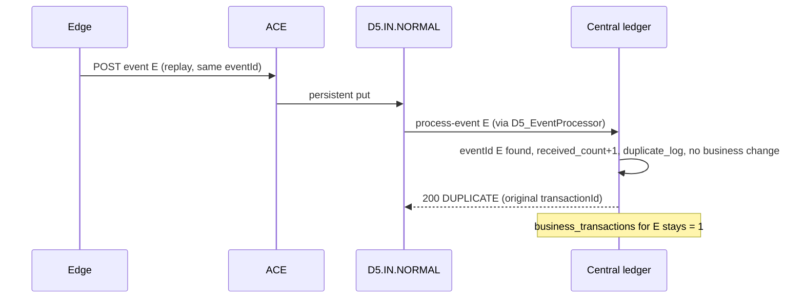
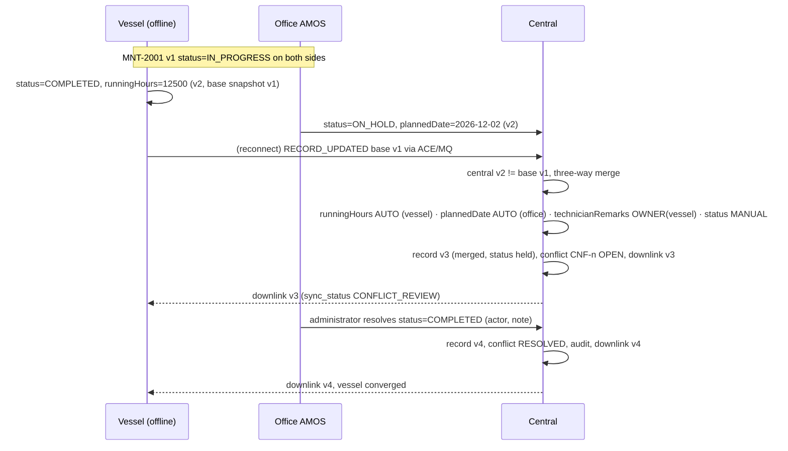
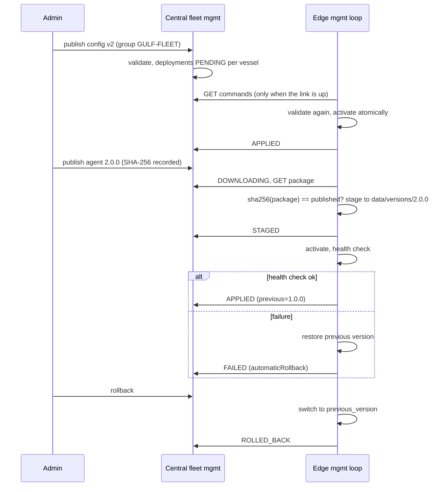

# D5 – Sequence Diagrams

## 1. Outage, offline work and priority drain

```mermaid
sequenceDiagram
  participant Crew
  participant Edge as Edge agent (VESSEL-01)
  participant Sat as Satellite relay
  participant ACE as ACE IS_D5_EDGE
  participant C as Central
  Crew->>Sat: (operator) DISCONNECT
  loop 10 records
    Crew->>Edge: create PR / GRN / MNT / EMR
    Edge->>Edge: record + outbox event (1 tx), PENDING
  end
  Edge->>Sat: POST event (highest priority)
  Sat--xEdge: connection closed (not forwarded)
  Edge->>Edge: link DOWN, back-off 2s,4s,8s... (events stay PENDING)
  Crew->>Sat: (operator) RECONNECT
  Edge->>Sat: heartbeat succeeds, link UP, back-off reset, sync session opened (backlog=10)
  loop until outbox empty: one in flight
    Edge->>ACE: next CRITICAL (then NORMAL, then LOW)
    ACE-->>Edge: 202 (persistent on D5.IN.<P>)
    Edge->>ACE: event-status?
    ACE->>C: ledger lookup
    C-->>Edge: PROCESSED + ackRecorded
    Edge->>Edge: ACKNOWLEDGED, delivery_order++
  end
```

## 2. Duplicate replay

```mermaid
sequenceDiagram
  participant Edge
  participant ACE
  participant MQ as D5.IN.NORMAL
  participant C as Central ledger
  Edge->>ACE: POST event E (replay, same eventId)
  ACE->>MQ: persistent put
  MQ->>C: process-event E (via D5_EventProcessor)
  C->>C: eventId E found, received_count+1, duplicate_log, no business change
  C-->>MQ: 200 DUPLICATE (original transactionId)
  Note over C: business_transactions for E stays = 1
```

## 3. Concurrent update and conflict

```mermaid
sequenceDiagram
  participant V as Vessel (offline)
  participant O as Office AMOS
  participant C as Central
  Note over V,O: MNT-2001 v1 status=IN_PROGRESS on both sides
  V->>V: status=COMPLETED, runningHours=12500 (v2, base snapshot v1)
  O->>C: status=ON_HOLD, plannedDate=2026-12-02 (v2)
  V->>C: (reconnect) RECORD_UPDATED base v1 via ACE/MQ
  C->>C: central v2 != base v1, three-way merge
  C->>C: runningHours AUTO (vessel) · plannedDate AUTO (office) · technicianRemarks OWNER(vessel) · status MANUAL
  C->>C: record v3 (merged, status held), conflict CNF-n OPEN, downlink v3
  C-->>V: downlink v3 (sync_status CONFLICT_REVIEW)
  O->>C: administrator resolves status=COMPLETED (actor, note)
  C->>C: record v4, conflict RESOLVED, audit, downlink v4
  C-->>V: downlink v4, vessel converged
```

## 4. Configuration and controlled version update

```mermaid
sequenceDiagram
  participant Admin
  participant C as Central fleet mgmt
  participant E as Edge mgmt loop
  Admin->>C: publish config v2 (group GULF-FLEET)
  C->>C: validate, deployments PENDING per vessel
  E->>C: GET commands (only when the link is up)
  E->>E: validate again, activate atomically
  E->>C: APPLIED
  Admin->>C: publish agent 2.0.0 (SHA-256 recorded)
  E->>C: DOWNLOADING, GET package
  E->>E: sha256(package) == published? stage to data/versions/2.0.0
  E->>C: STAGED
  E->>E: activate, health check
  alt health check ok
    E->>C: APPLIED (previous=1.0.0)
  else failure
    E->>E: restore previous version
    E->>C: FAILED (automaticRollback)
  end
  Admin->>C: rollback
  E->>E: switch to previous_version
  E->>C: ROLLED_BACK
```
